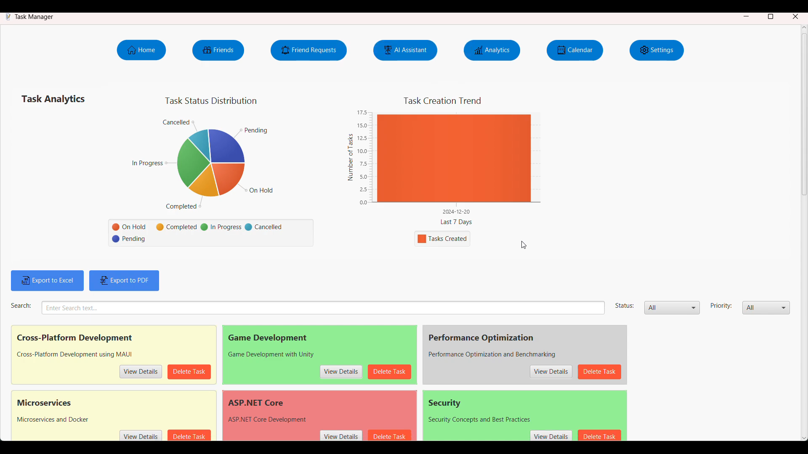

# AI Task Notifier

A full-stack task management application with social features, AI-powered assistance, and real-time notifications. Built with a Java Servlet backend and a JavaFX desktop client.

## Demo



**Video Walkthrough:** [Watch on YouTube](https://youtu.be/wm-W8HTUXHA?si=__UYAsBnJY15oZAq)

---

## Architecture

```
┌─────────────────────┐         HTTP/REST         ┌─────────────────────┐
│                     │  ◄──────────────────────►  │                     │
│   Hellofx (Client)  │    JSON + Bearer Token     │  servletnew (API)   │
│   JavaFX Desktop    │                            │  Jakarta Servlets   │
│                     │         WebSocket          │                     │
└─────────────────────┘                            └────────┬────────────┘
                                                            │
                                                   ┌────────▼────────────┐
                                                   │   SQL Server DB     │
                                                   │   TaskManagerDB     │
                                                   └─────────────────────┘
```

---

## Projects

### `servletnew/` — Backend API

A Java Servlet-based REST API that handles authentication, task management, social features, and admin operations. Deployed as a WAR on Apache Tomcat.

### `Hellofx/` — Desktop Client

A JavaFX desktop application providing a rich GUI for task management, friend interactions, AI assistant, analytics dashboards, calendar views, and data export.

---

## Features

### Task Management
- Create, read, update, and delete tasks
- Task priorities (High, Medium, Low) with color-coded status cards
- Due date tracking with overdue notifications
- Search and filter tasks by status or priority
- Drag-and-drop task rescheduling on calendar view
- Admin task assignment to any user

### Social Features
- Friend system (send, accept, reject, cancel requests)
- Mutual friends discovery
- User search by username
- Unfriend functionality

### AI Integration
- Google Gemini-powered AI assistant
- Quick actions: task steps, prioritization, time management, productivity tips
- Chat-style interface for task advice

### Analytics & Export
- Task status distribution (Pie Chart)
- Completion trends (Line Chart)
- Tasks by priority (Bar Chart)
- Export tasks to **PDF** (iTextPDF) or **Excel** (Apache POI)

### Admin Panel
- View all users with task counts
- Delete users and their tasks
- Assign tasks to specific users with email notification

### Settings & Theming
- Dark/Light theme toggle
- Notification preferences
- Privacy settings
- Data export/import/clear

---

## Tech Stack

| Layer | Technology |
|-------|-----------|
| Backend | Java, Jakarta Servlet API 5.0, Tomcat |
| Frontend | Java 21, JavaFX 21 (Controls, FXML, Web) |
| Database | Microsoft SQL Server (`mssql-jdbc`) |
| Authentication | JWT (`jjwt` + `java-jwt`), BCrypt |
| AI | Google Gemini API (OkHttp) |
| Email | Jakarta Mail (SMTP via Gmail) |
| PDF Export | iTextPDF 5.5.13 |
| Excel Export | Apache POI 5.2.3 |
| Voice | Vosk 0.3.32 |
| Build | Maven |

---

## API Endpoints

### Authentication
| Method | Endpoint | Description |
|--------|----------|-------------|
| POST | `/login` | Authenticate user, returns JWT |
| POST | `/signup` | Register new user, returns JWT |
| POST | `/autoLogin` | Validate existing JWT |

### Tasks
| Method | Endpoint | Description |
|--------|----------|-------------|
| GET | `/tasks?userId=X` | Get tasks for a user |
| POST | `/tasks?userId=X` | Create a task |
| PUT | `/tasks` | Update a task |
| DELETE | `/tasks` | Delete a task |

### Friends
| Method | Endpoint | Description |
|--------|----------|-------------|
| GET | `/friendrequest` | Get incoming friend requests |
| GET | `/friendrequest?sent=true` | Get sent friend requests |
| POST | `/friendrequest` | Send a friend request |
| PUT | `/friendrequest` | Accept/reject a request |
| DELETE | `/friendrequest` | Cancel a friend request |
| GET | `/friendship` | List friends |
| GET | `/friendship?action=mutual` | List mutual friends |
| DELETE | `/friendship` | Remove a friend |

### Admin
| Method | Endpoint | Description |
|--------|----------|-------------|
| GET | `/admin` | List all users with task counts |
| POST | `/admin` | Assign task to a user |
| DELETE | `/admin` | Delete a user |

### Search
| Method | Endpoint | Description |
|--------|----------|-------------|
| GET | `/search?searchTerm=X` | Search users by username |

---

## Database Schema

```sql
users          (id, username, password, role)
tasks          (id, title, description, due_date, priority, status, created_at)
user_tasks     (user_id, task_id)
friendships    (user_id, friend_id, friend_status)
Images         (image, user_id)
```

---

## Getting Started

### Prerequisites
- Java 21+
- Apache Maven 3.8+
- Microsoft SQL Server
- Tomcat 10+ (for WAR deployment)

### Database Setup
1. Create a database named `TaskManagerDB` in SQL Server
2. The application will create tables on first run

### Backend
```bash
cd servletnew
mvn clean package
# Deploy target/servletnew.war to Tomcat's webapps/
```

### Client
```bash
cd Hellofx
mvn clean compile
mvn javafx:run
```

### Configuration
- **Server URL**: Default `http://localhost:8080/servletnew` (configured in client source)
- **Database**: Connection string in `TaskServlet.java` and other servlet files
- **Gemini API Key**: Set in `AIAssistantService.java`
- **Email**: SMTP credentials in `EmailSender.java`

---

## Project Structure

```
AI-Task-Notifier/
├── servletnew/                    # Backend API
│   ├── pom.xml
│   └── src/main/webapp/
│       ├── controller/            # Servlets (API handlers)
│       │   ├── TaskServlet.java
│       │   ├── NewLogin.java
│       │   ├── signUp.java
│       │   ├── NewAdminServlet.java
│       │   ├── NewFriendRequestServlet.java
│       │   ├── NewFriendshipServlet.java
│       │   ├── NewSearchServlet.java
│       │   ├── NewJWTValidationFilter.java
│       │   ├── WebSocketServer.java
│       │   ├── EmailSender.java
│       │   └── Secret.java
│       ├── css/                   # FontAwesome & styles
│       ├── images/                # Static assets
│       ├── view/                  # JSP views
│       └── WEB-INF/web.xml
│
└── Hellofx/                       # Desktop Client
    ├── pom.xml
    └── src/main/java/com/example/hellofx/
        ├── HelloApplication.java  # Entry point
        ├── Home.java              # Main dashboard
        ├── Admin.java             # Admin panel
        ├── Task.java              # Task model
        ├── TaskClient.java        # Tasks API client
        ├── FriendClient.java      # Friends API client
        ├── FriendRequestClient.java
        ├── FriendsPage.java       # Friends UI
        ├── RequestsPage.java      # Friend requests UI
        ├── SharedTasksPage.java   # AI assistant page
        ├── Switch.java            # Navigation bar
        ├── CurrentUser.java       # User singleton
        ├── Token.java             # JWT token singleton
        ├── components/
        │   └── AIAssistantPanel.java
        ├── services/
        │   └── AIAssistantService.java
        ├── pages/
        │   ├── AnalyticsDashboard.java
        │   ├── CalendarView.java
        │   └── SettingsPage.java
        └── utils/
            ├── TaskAnalytics.java
            ├── TaskExporter.java
            ├── NotificationManager.java
            └── ThemeManager.java
```

---

## License

This project is for educational purposes.
